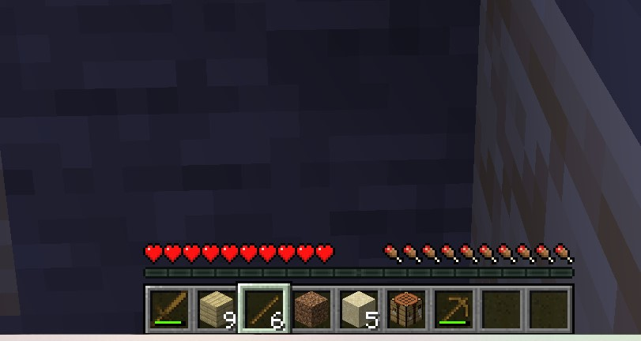

# my comments

He's lowkey super dumb. Also it takes forever to do something BUT HE DID WOODEN PICKAXE AND I'M PROUD OF HIM. His performance mostly depends on surroundings and he hates very complicated tasks (possibly because of llama 3B is too small). Also i'm extremly done and i don't want to do it



## Architecture

```
src/
├── index.js                    # Entry point — wires everything together
├── utils/
│   ├── config.js               # Env-var loader & validation
│   └── logger.js               # Lightweight levelled logger
├── bot/
│   ├── botFactory.js           # Mineflayer bot + plugin setup
│   └── chatRouter.js           # Chat listener & per-player task dispatch
├── llm/
│   ├── llmAgent.js             # Core agentic loop (tool-call ↔ result cycle)
│   ├── systemPrompt.js         # LLM system instructions
│   └── providers/
│       ├── providerFactory.js  # Selects provider from config
│       ├── ollamaProvider.js   # Local Ollama (llama3.2, mistral, qwen2.5…)
│       ├── anthropicProvider.js# Anthropic Claude API
│       └── openaiProvider.js   # OpenAI / any OpenAI-compatible API
└── tools/
    ├── toolRegistry.js         # Central tool registry
    ├── moveTool.js             # Navigate to coordinates
    ├── miningTool.js           # Find & mine blocks
    ├── inventoryTool.js        # List / find / drop items
    ├── craftingTool.js         # Craft items from recipes
    ├── inspectTool.js          # Scan nearby blocks & entities
    ├── equipTool.js            # Equip items
    ├── attackTool.js           # Fight entities
    └── chatTool.js             # Send in-game chat messages
```

---

## Prerequisites

| Requirement | Version |
|---|---|
| Node.js | ≥ 20.0.0 |
| Minecraft Java Edition | 1.20.x (matches `MC_VERSION` in `.env`) |
| Ollama *(local mode)* | ≥ 0.3.x |

---

## Quick Start

### 1 — Install dependencies

```bash
git clone <repo>
cd minecraft-llm-bot
npm install
```

### 2 — Configure environment

```bash
cp .env.example .env
```

Edit `.env`:

```env
# ── Minecraft server ──────────────────────────────
MC_HOST=localhost
MC_PORT=25565
MC_USERNAME=LLMBot
MC_VERSION=1.20.1

# ── LLM provider: ollama | anthropic | openai ─────
LLM_PROVIDER=ollama

# ── Ollama (if using local model) ─────────────────
OLLAMA_HOST=http://localhost:11434
OLLAMA_MODEL=llama3.2

# ── Anthropic (if using Claude) ───────────────────
# ANTHROPIC_API_KEY=sk-ant-...
# ANTHROPIC_MODEL=claude-3-5-haiku-20241022

# ── OpenAI (if using GPT) ─────────────────────────
# OPENAI_API_KEY=sk-...
# OPENAI_MODEL=gpt-4o-mini
```

### 3 — Start your Minecraft server

Start a local server in **offline mode** (for testing) or connect to an existing one.

For a quick local test server (Paper / Vanilla):

```bash
# Example using a local Paper server jar
java -jar paper.jar --nogui
```

Make sure `online-mode=false` in `server.properties` when using offline auth.

### 4 — Run the bot

```bash
npm start
```

You should see:

```
[INFO] Starting Minecraft LLM Bot…
[INFO]   Server  : localhost:25565
[INFO]   Username: LLMBot
[INFO]   Provider: ollama
[INFO] Bot spawned in the world.
[INFO] ChatRouter listening for prefix: "llm-bot"
```

---

## Using the Bot In-Game

Join the same Minecraft server and type in chat:

```
llm-bot <your goal>
```

### Example Commands

| Chat message | What the bot does |
|---|---|
| `llm-bot find a diamond shovel and equip it` | Checks inventory, searches for the item, equips it |
| `llm-bot mine 5 oak logs` | Walks to nearest oak trees and collects 5 logs |
| `llm-bot craft a wooden pickaxe` | Gathers wood if needed, crafts pickaxe |
| `llm-bot kill the nearest zombie` | Scans for zombies, approaches, fights |
| `llm-bot what's in your inventory?` | Lists all held items in chat |
| `llm-bot go to 100 64 200` | Pathfinds to those coordinates |

---

## Local LLM Setup (Ollama)

Install Ollama: https://ollama.com

Pull a model that supports tool calling:

```bash
# Good small models for tool calling:
ollama pull llama3.2          # 3B — fast, decent tool calling
ollama pull qwen2.5:7b        # 7B — excellent tool calling
ollama pull mistral-nemo      # 12B — high quality
```

Set in `.env`:

```env
LLM_PROVIDER=ollama
OLLAMA_MODEL=llama3.2
```

> **Tip:** Larger models (7B+) follow tool-call schemas more reliably.
> `llama3.2` (3B) works well for simple tasks; use `qwen2.5:7b` for complex multi-step goals.

---

## OpenAI-Compatible Local APIs

You can point the OpenAI provider at any compatible local server (LM Studio, vLLM, llama.cpp server):

```env
LLM_PROVIDER=openai
OPENAI_API_KEY=not-needed        # some servers require a non-empty value
OPENAI_BASE_URL=http://localhost:1234/v1
OPENAI_MODEL=your-model-name
```

---

## Adding New Tools

1. Create `src/tools/myTool.js`:

```js
export const myTool = {
  schema: {
    name: "my_tool",
    description: "What this tool does.",
    inputSchema: {
      type: "object",
      properties: {
        param: { type: "string", description: "A parameter" },
      },
      required: ["param"],
    },
  },

  async execute(bot, { param }) {
    // your Mineflayer logic here
    return { success: true, result: param };
  },
};
```

2. Register it in `src/tools/toolRegistry.js`:

```js
import { myTool } from "./myTool.js";

const ALL_TOOLS = [
  // existing tools...
  myTool,
];
```

That's it — the tool is automatically exposed to the LLM on next startup.

---

## Configuration Reference

| Variable | Default | Description |
|---|---|---|
| `MC_HOST` | `localhost` | Minecraft server hostname |
| `MC_PORT` | `25565` | Minecraft server port |
| `MC_USERNAME` | `LLMBot` | Bot username (offline mode) |
| `MC_VERSION` | `1.20.1` | Minecraft version string |
| `LLM_PROVIDER` | `ollama` | `ollama` \| `anthropic` \| `openai` |
| `OLLAMA_HOST` | `http://localhost:11434` | Ollama server URL |
| `OLLAMA_MODEL` | `llama3.2` | Ollama model name |
| `ANTHROPIC_API_KEY` | — | Your Anthropic API key |
| `ANTHROPIC_MODEL` | `claude-3-5-haiku-20241022` | Claude model ID |
| `OPENAI_API_KEY` | — | Your OpenAI API key |
| `OPENAI_BASE_URL` | *(OpenAI default)* | Override for local APIs |
| `OPENAI_MODEL` | `gpt-4o-mini` | OpenAI model name |
| `TRIGGER_PREFIX` | `llm-bot` | Chat prefix that activates the bot |
| `MAX_STEPS` | `20` | Max LLM tool-call iterations per task |
| `COMMAND_COOLDOWN_MS` | `5000` | Per-player cooldown in ms |
| `LOG_LEVEL` | `info` | `debug` \| `info` \| `warn` \| `error` |

---

## How It Works — Agentic Loop

```
Player types: "llm-bot mine 3 diamonds"
        │
        ▼
  ChatRouter detects prefix
        │
        ▼
  LLMAgent.runTask(goal)
        │
        ├─► Build environment snapshot (position, inventory, nearby entities)
        │
        ├─► Send [system prompt + snapshot + goal] to LLM
        │
        ├─► LLM responds with tool call:
        │     inspect_surroundings({blockType: "diamond_ore"})
        │
        ├─► Execute tool → result returned to LLM
        │
        ├─► LLM responds with next tool call:
        │     mine_block({blockType: "diamond_ore", count: 3})
        │
        ├─► Execute tool → result returned to LLM
        │
        └─► LLM responds with text (no tool call) → task complete
                │
                ▼
          Bot chats: "@Player Done! Mined 3 diamonds."
```

---

## Troubleshooting

**Bot connects but doesn't respond to chat**
- Check `TRIGGER_PREFIX` matches what you're typing exactly
- Make sure you're not on cooldown (default 5 s)
- Check console for errors

**"No path found" errors**
- The bot may be stuck or the target may be unreachable
- Try a simpler task first; complex terrain can confuse the pathfinder

**LLM calls wrong/nonexistent tools**
- Use a larger model (7B+) for better instruction following
- Add more context to your goal: "mine 3 diamond_ore blocks" rather than "get diamonds"

**Ollama tool calling not working**
- Ensure your Ollama version is ≥ 0.3.x (`ollama --version`)
- Not all models support tool calling; prefer `llama3.2`, `qwen2.5`, or `mistral-nemo`

---

## Extending for Production

- **Persistence**: Store task history in SQLite for debugging
- **Web dashboard**: Add an Express server to monitor bot state via browser
- **Multi-bot**: Run multiple bot instances for different players/tasks
- **Auth**: Add a whitelist of allowed player usernames in `ChatRouter`
- **Memory**: Give the LLM a summary of past tasks for continuity
